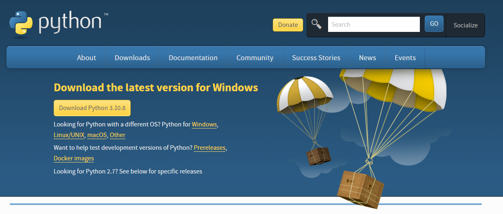
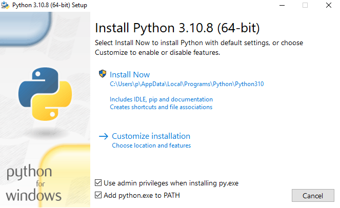
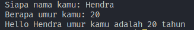
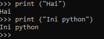
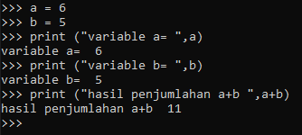
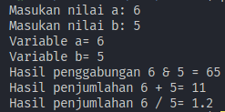

# Nama = Hendra Parsaulian
# Nim = 312210689

## Instalasi Python
• Bagi pengguna Linux, Python tidak perlu diinstal.
Karena Sebagian besar distro Linux sudah
menyediakannya secara default.  
• Bagi pengguna Windows, Download di situs resmi
python (python.org). Ikuti langkah instalasinya.

  
  

# Contoh Perintah Dasar Python
```py
nama = input("Siapa nama kamu: ")
umur = input("Berapa umur kamu: ")

print("Hello",nama,"umur kamu adalah",umur,"tahun")
```

# Contoh Latihan 1

• Menjalankan Python Console  
• Menampilkan tulisan "Hello" dilayar  
• Menampilkan tulisan "Ini Python"  

Dengan cara :
1. Buka Command Prompt 
2. Lalu ketik python lalu enter  
3. Cara menampilkan tulisan "Hai" gunakan ```print("Hai")```  
4. Menampilkan tulisan "Ini Python" ```print("Ini Python")```  

 

# Contoh Latihan 2 

• Menjumlahkan dua buah bilangan menggunakan variabel a dan b.  
• Mendefinisikan variable a dengan nilai 6  
• Mendefinisikan variable b dengan nilai 5  
• Mencetak nilai variable a dan b  
• Mencetak hasil penjumlahan a+b  

```py
a = 6  
b = 5  
print ("variable a= ",a)  
print ("variable b= ",b)  
print ("hasil penjumlahan a+b ",a+b)  
```

  

# Contoh Latihan 3

• Menjalankan IDLE  
• Membuat file baru dengan nama latihan3.py (pastikan lokasi file pada folder lab2py pada direktori kerja anda)  
• Menggunakan fungsi input untuk mengambil nilai variabel dari keyboard.  

```py
# Input nilai variable
a=input("Masukan nilai a: ")
b=input("Masukan nilai b: ")

# Mencetak nilai variable
print("Variable a=",a)
print("Variable b=",b)

# Cetak hasil oprasi kedua variable 
print ("Hasil penggabungan {0} & {1} = %d".format(a,b) %(a+b))

#Konversi nilai variable

a=int(a)
b=int(b)

print("Hasil penjumlahan {0} + {1}= %d".format(a,b) %(a+b))
print("Hasil penjumlahan {0} / {1}= %d".format(a,b) %(a/b))
```  

